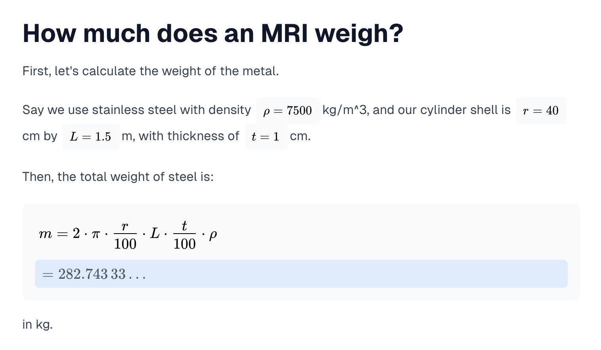

# Mathdocs

Jupyter-notebook like documents for math.



## Getting started

Install the dependencies

```bash
npm install
```

Run it

```
npm run dev
```

Visit `http://localhost:3000` in your browser.
